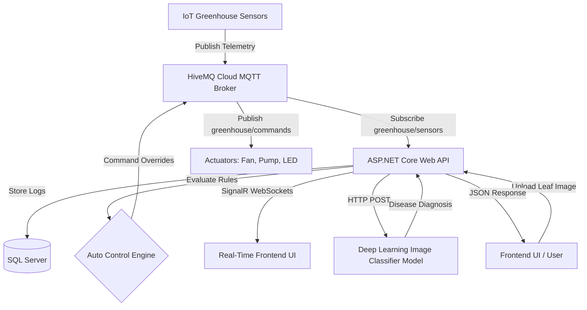

# Touch Of Nature - IoT Smart Greenhouse API 🌿🤖

Touch Of Nature is a real-time, IoT-driven backend API developed with ASP.NET Core (.NET 8). The platform provides remote monitoring, dynamic rules-based automation, and deep learning-based crop health diagnostics to create a smart, self-regulating greenhouse ecosystem.

---

## 🏗️ System Architecture

The following diagram illustrates how telemetry data flows from the IoT greenhouse sensors to the client dashboard, how the automatic control loop operates, and how leaf disease diagnostics are processed.



---

## ✨ Key Features

- **Bidirectional IoT Communication**: Subscribes to greenhouse sensor topics and publishes real-time command overrides (Fan, LED lighting, Water Pump) using `MQTTnet` connected to a secure **HiveMQ Cloud** broker.
- **Intelligent Automation Loop**: Houses a threshold-based automatic rules engine. When enabled, it evaluates sensor telemetry in real-time and executes commands based on configurable limits:
  - **Low Soil Moisture** $\rightarrow$ Turns on Water Pump.
  - **High Temperature or Humidity** $\rightarrow$ Turns on Fan.
  - **Low Light Levels (LDR)** $\rightarrow$ Turns on LED light.
- **Instant Client Broadcasting**: Leverages **SignalR Hubs** to stream live telemetry updates to web dashboards instantly without requiring HTTP polling.
- **AI-Driven Crop Diagnostics**: Integrates an image classification endpoint using computer vision to diagnose crop and leaf diseases from uploaded images (`.jpg`, `.png`).
- **Telemetry History**: Persists historical sensor telemetry (soil moisture, light levels, temperature, and humidity) into MS SQL Server using Entity Framework Core.

---

## 🛠️ Tech Stack

- **Framework**: .NET 8 (ASP.NET Core Web API)
- **Database**: Microsoft SQL Server
- **ORM**: Entity Framework Core (EF Core)
- **Protocols**: MQTT (MQTTnet Client), WebSockets (SignalR)
- **MQTT Broker**: HiveMQ Cloud (TLS Enabled)
- **Libraries & Tools**: HttpClient, AutoMapper, Swagger (OpenAPI)

---

## 🔌 API Endpoints Summary

### 1. Greenhouse Actuator Override Control (`/api/Greenhouse`)
* **`POST /api/Greenhouse/fan/on`** | **`off`** — Send manual override commands to turn the greenhouse ventilation fan on or off.
* **`POST /api/Greenhouse/led/on`** | **`off`** — Send manual override commands to turn the grow LED lighting on or off.
* **`POST /api/Greenhouse/pump/on`** | **`off`** — Send manual override commands to turn the water irrigation pump on or off.

### 2. Auto-Control Configuration (`/api/Greenhouse`)
* **`GET /api/Greenhouse/auto-control-get`** — Retrieve the current auto-control threshold configurations.
* **`PUT /api/Greenhouse/auto-control-enable?Enable=true`** — Turn the automated control loop on or off.
* **`PUT /api/Greenhouse/auto-control-update`** — Dynamically update the temperature, humidity, LDR, and soil moisture sensor thresholds.

### 3. Telemetry Logs (`/api/SensorsOutput`)
* **`GET /api/SensorsOutput`** — Retrieve all historical sensor logs stored in the database.
* **`DELETE /api/SensorsOutput`** — Wipe out historical sensor telemetry logs.

### 4. AI Diagnostics (`/api/Model`)
* **`POST /api/Model/predict-leaf-disease`** — Upload a leaf image (`.jpg`/`.png`) to get leaf disease diagnostic classification from the machine learning model.

---

## 📡 MQTT Topics

- **`greenhouse/sensors`**: The topic where the IoT greenhouse hardware publishes sensor payloads in JSON format:
  ```json
  {
    "soil": 35,
    "light": 620,
    "temp": 28.5,
    "humidity": 65.2
  }
  ```
- **`greenhouse/commands`**: The topic where the API publishes actuator state commands (`LED_ON`, `LED_OFF`, `FAN_ON`, `FAN_OFF`, `PUMP_ON`, `PUMP_OFF`).
